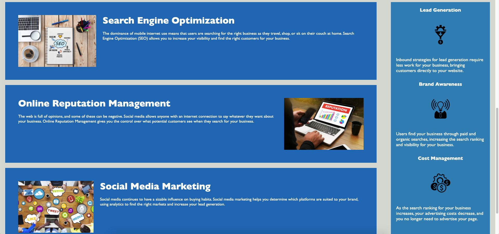

# Code Refactor - Horiseon Website

## Accessibility

This is where we refactor the code elements of the **Horiseon** website for the purpose of making it more accessible to users with visual, hearing, or other impairments.

Given the initial code for the Horiseon Search Engine Optimization Website, there were issues with the nature of the tags used to develop the page. Although the site was almost entirely functional, aside from a broken button in the header that linked to content lower down on the page, most of the semantic tags to identify and compartmentalize different page elements for impaired users/screen-readers were missing.

Through the refactorization of the Horiseon code, it was also necessary to comment out many of the changes in order to explain and identify what the specific issues were. After applying the correct semantic tags to the page's elements and fixing the button to the respective page content to the Search Engine Optimization button, it was also necessary to consilidate/comment on the functionality of the style.css file.

- HTML
- CSS

> **[Code Refactor - Horiseon Services Website](https://jimbopulos.github.io/code-refactor-Horiseon-Website/)**

> **[Code Refactor - Horiseon Services Respository](https://github.com/jimbopulos/code-refactor-Horiseon-Website)**
